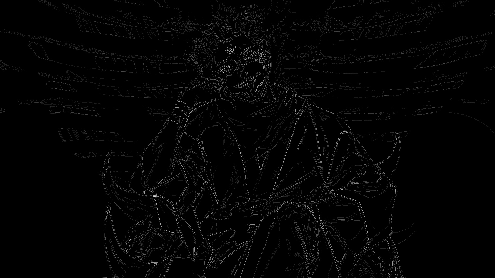

# canny-edge-detector

A canny edge detector written in C++ which only uses OpenCV for file reading/writing. The canny edge detection involved implementing the following without any external libraries: a gaussian blur, a Sobel filter as the edge detection operator, non-maximum suppression, and double thresholding.

## Example:

### Original Image

### Image after Canny Edge Detection

